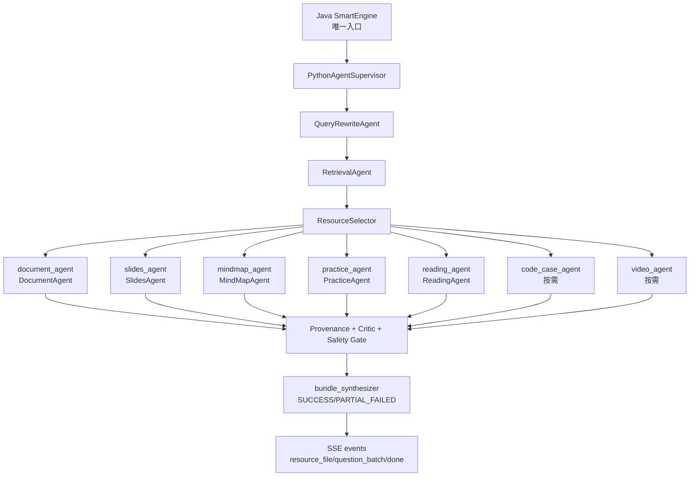

# Graph 多智能体资源包架构说明

更新日期：2026-05-20

## 目标边界

本分支 `codex/graph-multi-agent` 的目标不是替换 Java 入口、Redis Streams、SSE 协议或下载签名机制，而是在 Python Agent 内部把 `RESOURCE_GENERATION` 从“按 `resourceType` 选一个生成器”升级为“Graph 编排的资源包工作流”。

硬边界：

- 没有真实 LLM 输出，就不能发布生成资源。
- LLM key 缺失、模型不可用、结构化输出校验失败时，任务失败，不返回模板文档、模板题、规则总结冒充产物。
- 规则只用于检索、过滤、格式校验、安全拦截和事实检查，不能作为主要内容生成。
- 每个可发布资源必须携带 `generatedBy=LLM`、`contentOrigin=LLM`、`provider`、`model`、`agentName`、`evidenceIds`、`fallback=false`、`fromCache`。
- 前端实时 SSE 和轮询/刷新快照收到缺失 provenance 的生成资源时都不展示资源卡片，只展示失败提示。

参考的官方架构依据：

- LangChain multi-agent 文档建议在需要上下文隔离、并行化、专门职责和顺序约束时使用多智能体模式；本分支采用 Router/Custom workflow 思路。
- LangGraph 文档定位为低层级、有状态、长任务 Agent 编排运行时；本分支用 `StateGraph` 固化资源生成的状态流。
- Deep Agents 文档强调 coordinator-worker、规划、子 Agent 隔离和文件/记忆能力；本分支没有引入 `deepagents` 依赖，而是吸收其 coordinator-worker 思路，保留当前项目已有 Agent 和 SSE 体系。

官方链接：

- https://docs.langchain.com/oss/python/langchain/multi-agent
- https://docs.langchain.com/oss/python/langgraph
- https://docs.langchain.com/oss/python/deepagents/overview

## 和当前主线架构的具体差异

旧路径：

1. Java 通过 SmartEngine 提交任务。
2. Python `PythonAgentSupervisor.resolve_route()` 根据 `resourceType` 选一个 `{generation_agent}`。
3. 路由通常是 `query_rewrite -> retrieval -> document_generator/slide_generator/...`。
4. 生成 Agent 自己产出 `resource_file`。

Graph 分支路径：

1. Java 入口不变。
2. `RESOURCE_GENERATION` 路由固定为 `query_rewrite -> retrieval -> resource_bundle`。
3. `resource_bundle` 由 `ResourceBundleWorkflow` 的 LangGraph `StateGraph` 执行；Graph 内部有显式 `document_agent`、`slides_agent`、`mindmap_agent`、`practice_agent`、`reading_agent`、`code_case_agent`、`video_agent` 节点。
4. Graph 中 `query_rewrite`、`retrieval` 串行执行，确保检索吃到改写后的 query。
5. Graph 中资源 Agent 按用户选择的 `resourceTypes[]` 并行 fan-out；前端只暴露原有资源生成类型，选择 1 个或多个都可以，后端不再自动补齐到 5 类。未传 `resourceTypes/resourceType` 时仅沿用旧默认讲解文档 `DOCUMENT`。
6. `RESOURCE_GENERATION` 下的 `QueryRewriteAgent` 使用严格 LLM 模式，改写失败不会静默退回规则改写。
7. 所有资源事件先过 provenance gate，缺字段、`contentOrigin != LLM`、`fallback != false` 或缺 `fromCache` 直接失败，不发布资源。
8. Graph 全失败时只发 `error` + `done(status=FAILED)`，不发半成品 `resource_file` / `question_batch`；部分资源失败但至少一个资源真实生成成功时，发布成功资源并以 `done(status=PARTIAL_FAILED)` 明确列出失败资源。
9. Java 入口对 `resource_file`、`question_batch` 和携带脚本/音频/视频素材的 `video_gen:*` 事件做二次 provenance 校验，校验失败改写为 `error(PROVENANCE_INVALID)`，不签发下载链接。

## 2026-05-20 复审结论

结论要分层看：

- `RESOURCE_GENERATION` 已符合 Graph 多智能体资源包目标：入口是 LangGraph `StateGraph`，先串行完成 query rewrite 与 retrieval，再按用户请求的资源类型显式并发 fan-out 到对应资源 Agent 节点，最后由 `bundle_synthesizer` 汇总。新增测试会让多个被请求的 Agent 在同一个 barrier 前等待，只有真实并发启动才会通过。
- 各个路由 Agent 已做可路由性校验：`supervisor_routes.json` 中的 Agent 必须存在于 `agent_registry`，或显式属于虚拟节点 `{generation_agent}` / `resource_bundle`。这保证“配置上能调到”的 Agent 不会是悬空名字。
- QNA 对话并发已加固：前端不再用单个 `qnaAbortRef` 管全部问答流，而是按 `conversationId` 维护独立 `AbortController`。切到另一个对话时，旧对话的 SSE 继续写入自己的 conversation cache；新对话可以继续发送消息。后端 `conversationTaskExecutor` 是 virtual-thread `SimpleAsyncTaskExecutor`，并发上限 8，支持多个对话流同时执行。
- 不能把整个系统说成“所有服务都已经 Graph 化”。当前真正 Graph 化的是 `RESOURCE_GENERATION`；`TUTORING`、`VIDEO_GENERATION`、`PRACTICE_JUDGE`、`PATH_PLANNING`、`LEARNING_ASSESSMENT` 仍主要是 Supervisor 顺序路由或单 Agent 内部工作流。它们是可用 Agent 链路，但不是资源包这种 Graph fan-out 协作。
- 无伪生成边界当前强约束在“可发布生成资源”上：`resource_file`、`question_batch`、携带脚本/音频/视频素材的 `video_gen:*` 必须带 `generatedBy=LLM` 与 `contentOrigin=LLM`。`CriticAgent` / `SafetyAgent` 的规则 fallback 只用于审核信号，不发布为生成内容。Profile/Judge/PathPlanning 中仍存在存储 fallback 或规则辅助逻辑，不能在答辩中夸成“所有非资源数据都只由 LLM 生成”；若要全域 LLM-only，需要继续把这些非资源输出也加 provenance 或显式标注 `contentOrigin=RULE_CHECK`。

## Agent 职责

`RouterAgent`

当前仍由 `PythonAgentSupervisor.resolve_route()` 承担。它决定任务进入资源包、视频、辅导、评估、路径规划等路径。Graph 分支中，`RESOURCE_GENERATION` 不再按单个资源类型选择生成 Agent，而是进入 `resource_bundle`。

`ProfileInterpreterAgent`

当前画像解释分散在 `SnapshotBuilder` 和各 Agent 的 `system_prompt()` 中。本分支未新增独立类，后续建议把画像转学习约束的逻辑拆出，产出只作为约束，不直接生成内容。

`QueryRewriteAgent`

负责 LLM 查询改写和关键词提取。Graph 中它必须先于检索执行；`RESOURCE_GENERATION` 下 LLM 改写失败会阻断资源生成，不静默退回规则改写。

`RetrievalAgent`

负责真实知识库和 Web 证据检索。已移除“无结果时造 fallback 文档”的行为：无命中就返回空文档列表，不再产生 `fallback-*` 假来源。

`DocumentAgent`

调用 `ResourceGenerationService` 和 `ContentGenerationChain` 生成讲解文档。产物必须来自 LLM，并由 Critic/Safety 复核。

`SlidesAgent`

生成 PPT 或 PPT 大纲。若 PPTX 专用模型不可用，可以走另一个真实 LLM 生成 Markdown 大纲，但不能用模板 PPT 伪装。

`MindMapAgent`

生成 Mermaid 思维导图。Mermaid 格式化是规则处理，核心节点内容必须来自 LLM。

`PracticeAgent`

生成练习题。已删除静态题目模板 fallback。`PracticeQuestionGenerator` 失败时抛出明确错误，不返回模板题。

`ReadingAgent`

生成拓展阅读材料。只发布真实 LLM 输出。

`CodeCaseAgent`

生成代码实操案例。只发布真实 LLM 输出，规则只能用于格式化代码块、语言标识和安全检查。

`VideoAgent`

负责视频脚本、TTS、浏览器渲染素材链路。脚本必须由 LLM 生成；TTS 失败会明确失败，不伪造音频或视频文件。`video_gen:script/speech/avatar/complete` 中凡携带脚本、音频或渲染素材的 payload 都带同一组 LLM provenance，前端本地渲染前也会校验。

`CriticAgent`

检查事实支撑、难度匹配和引用覆盖。规则 fallback 只作为审核信号，不作为主要资源内容发布。

`SafetyAgent`

检查内容安全、学术诚信和违规风险。规则 fallback 只用于拦截和风险判断。

`BundleSynthesizerAgent`

当前由 `ResourceBundleWorkflow` 的汇总逻辑承担：只把已通过 provenance gate 的 `resource_file` 和 `question_batch` 汇总到 `generatedAssets`。

`PathPlanningAgent`

保持现状，基于画像、评估和资源产物生成学习路径。后续建议读取 `generatedAssets` 时只接受 provenance 合格的资源。

`ResourcePushAgent`

外部链接必须来自真实搜索结果；生成型 PPT 推送已补充 LLM provenance。无 Tavily key 或无结果时返回空推荐，不造外部链接。

`EvaluationAgent`

专项评估报告必须来自 `EvaluationGenerator`，报告 `resource_file` 带 LLM provenance；交互评估题统一走 `PracticeQuestionGenerator`，题目生成失败时任务失败，不再回落到静态测评题。

`DeepReasoningAgent`

工具循环超限时允许再走一次真实 direct LLM completion；direct LLM 不可用或返回空内容时直接失败，不再拼接规则式“深度思考”答案。

## 关键代码位置

- Graph 编排：`python-agent/src/ai_modules/runtime/resource_bundle_workflow.py`
- provenance 规则：`python-agent/src/ai_modules/runtime/provenance.py`
- Supervisor 接入：`python-agent/src/ai_modules/supervisor.py`
- Query rewrite 严格模式：`python-agent/src/ai_modules/agents/query_rewrite_agent.py`
- 生成 Agent 出口 provenance gate：`python-agent/src/ai_modules/agents/generation/generators.py`
- 生成资源元数据：`python-agent/src/ai_modules/models/events.py`
- 练习题元数据：`python-agent/src/ai_modules/models/practice.py`
- Practice 禁止模板 fallback：`python-agent/src/ai_modules/agents/practice_agent.py`
- Evaluation 禁止静态测评题 fallback：`python-agent/src/ai_modules/agents/evaluation_agent.py`
- DeepReasoning 禁止规则答案 fallback：`python-agent/src/ai_modules/agents/deep_reasoning_agent.py`
- 前端 provenance 拦截：`frontend/src/pages/LearningStudioDemoPage.utils.ts`
- Java Done=FAILED 状态修正与 provenance 二次校验：`project/src/main/java/com/project/application/smartengine/TaskStateMachineService.java`

## 验证口径

已新增/更新测试覆盖：

- LLM 不可用时资源包失败，且不发布 `resource_file` / `question_batch`。
- `RESOURCE_GENERATION` 下 query rewrite LLM 失败时不退回规则改写。
- `resourceTypes[]` 会按用户选择的任意数量 fan-out 到对应显式 Graph 资源 Agent 节点，并通过 barrier 测试确认多个被请求资源真实并发。
- 单个资源 Agent 失败但其他资源真实生成成功时，返回 `PARTIAL_FAILED`，只展示成功资源和失败说明。
- 所有发布资源必须带 `generatedBy/contentOrigin/provider/model/agentName/evidenceIds/fallback=false/fromCache`。
- `PracticeAgent` LLM 失败时不再返回模板题。
- `EvaluationAgent` 练习掌握等交互评估题 LLM 失败时不再返回静态题。
- `DeepReasoningAgent` direct LLM 不可用时不再返回规则式回答。
- 前端实时 SSE 与任务快照恢复路径都拒绝缺 provenance 的生成资源。
- Java 对缺 provenance 的生成资源拒绝落库为成功资源并拒绝签发下载链接。
- SSE event 类型不变，只扩展 payload 字段。
- 检索无结果不再伪造 fallback 文档。
